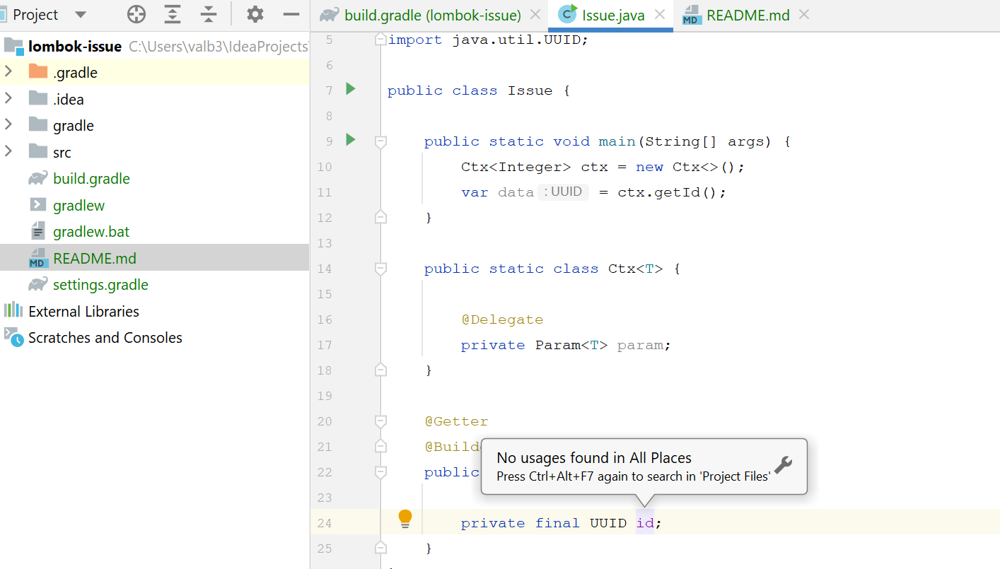

# Issue

```
IntelliJ IDEA 2021.2.3 (Ultimate Edition)
Build #IU-212.5457.46, built on October 12, 2021
Licensed to Valentyn Berezin
You have a perpetual fallback license for this version.
Subscription is active until December 30, 2022.
Runtime version: 11.0.12+7-b1504.40 amd64
VM: OpenJDK 64-Bit Server VM by JetBrains s.r.o.
Windows 10 10.0
GC: G1 Young Generation, G1 Old Generation
Memory: 2024M
Cores: 8
Non-Bundled Plugins: com.jfarrelly.intellij.plugin.method.parameter.order.code.inspection (1.1.0), org.intellij.plugins.hcl (0.7.14), YourKit Java Profiler 2021.11-b219 Integration (2021.11.219.0), flowable-bpmn-visualizer (0.4.8), org.jetbrains.kotlin (212-1.6.0-release-799-IJ5457.46), Karma (212.4746.57)
Kotlin: 212-1.6.0-release-799-IJ5457.46
```

